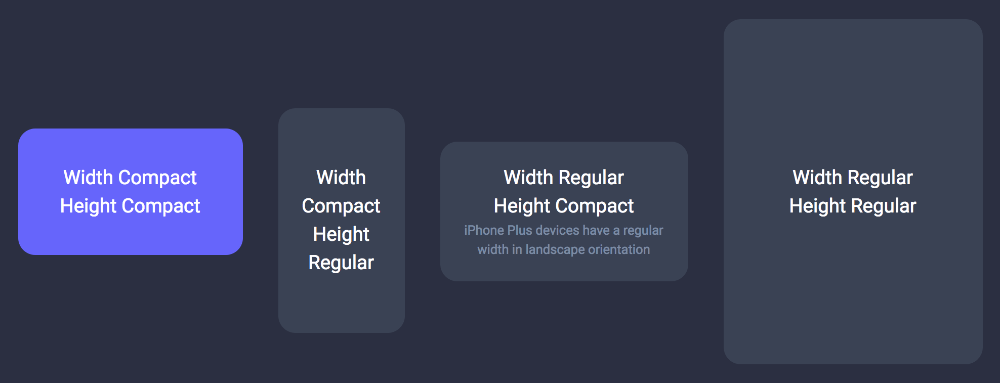

# iOS Size Classes in CSS

  

## Overview

⚠️ **This is experimental** ⚠️ 

This script applies CSS classes to the `body` to mimic iOS Size Classes.
It can be used for single-page applications or to take into account the height of the window in landscape mode.

Pull requests are welcome!

### [Demo](https://charlestati.github.io/size-classes/)

## Quickstart

Add [size-classes.min.js](docs/size-classes.min.js) to your page

#### Classes applied to `body`

- `sc-wc` when the width of the window is compact
- `sc-wr` when the width of the window is regular
- `sc-hc` when the height of the window is compact
- `sc-hr` when the height of the window is regular

Similar to Xcode, this script does not only use the width of the window to choose the class to apply.

## Browser Support

- Chrome
- Firefox
- Safari

Probably Edge, Internet Explorer 11+ and Opera too.

## Todo

- [ ] Fine-tune the breakpoints for a web-first experience 
- [ ] Publish to npm

## License

Apache 2.0
